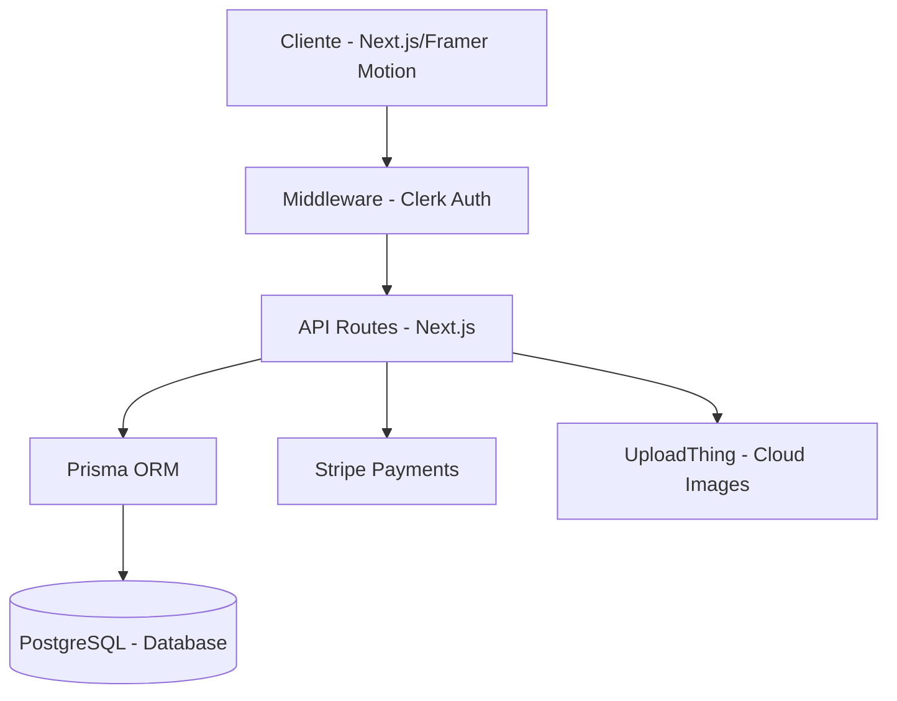

<div align="center">
  
  
  # 🏎️ Rental Cars - Luxury Fleet Experience
  
  ### **La cumbre del alquiler de vehículos premium, donde la ingeniería se encuentra con la elegancia.**
  
  [](https://github.com/Jonathan-Fleitas-Perez/rental-cars)
  [](https://nextjs.org/)
  [](https://stripe.com/)
  [](https://clerk.com/)

  [Explorar Catálogo](/cars) • [Ver Dashboard](/dashboard) • [Reportar Bug](https://github.com/Jonathan-Fleitas-Perez/rental-cars/issues)
</div>

---

## 📖 Introducción

**Rental Cars** no es solo una aplicación de reserva; es una plataforma de hospitalidad automotriz diseñada para el segmento de lujo. Construida con el **App Router de Next.js 16**, la plataforma ofrece una experiencia de usuario ultra-fluida mediante animaciones de alto nivel con **Framer Motion**, pagos seguros con **Stripe** y una gestión de datos eficiente con **Prisma ORM**.

> [!IMPORTANT]
> **Proyecto Profesional**: Implementa patrones **SOLID**, **Clean Architecture** y un sistema de diseño basado en **shadcn/ui** totalmente personalizado.

---

## 🚀 Arquitectura del Sistema



---

## ✨ Características Destacadas

### 💎 Experiencia de Usuario (UX)
- **Loading Experience**: Pantalla de carga profesional con animaciones orbitales y transiciones de salida suavizadas.
- **Micro-interacciones**: Efectos de "float" en vehículos, reveals al hacer scroll y hovers cinéticos en tarjetas de coches.
- **Favoritos Offline-First**: Sistema de guardado con **Zustand** y persistencia en `localStorage`.

### 🛠️ Herramientas de Administración
- **Cars Manager**: CRUD completo con validación server-side mediante **Zod**.
- **Reserves Admin**: Panel centralizado para confirmar, cancelar y monitorear reservaciones globales.
- **Analytics Visuals**: Visualización clara del estado de la flota (Publicado vs. No Publicado).

### 💳 Ecosistema de Pagos y Media
- **Stripe Checkout**: Sesiones de pago seguras con redireccionamiento inteligente post-confirmación.
- **UploadThing**: Subida de imágenes optimizada con previsualización inmediata y validación de tipos.

---

## 🛠️ Stack Tecnológico Premium

| | Tecnología | Uso en el Proyecto |
|---|---|---|
| 🏗️ | **Next.js 16** | SSR, API Routes, Route Groups e Image Optimization. |
| 🛡️ | **TypeScript** | Tipado estricto en toda la aplicación para evitar errores en runtime. |
| 🎨 | **Tailwind CSS** | Sistema de diseño adaptativo con temas Dark/Light. |
| ✨ | **Framer Motion** | Animaciones declarativas y efectos de scroll de alta gama. |
| 🗝️ | **Clerk** | Autenticación B2C, sesiones y webhooks de usuario. |
| 🏦 | **Stripe** | Procesamiento de pagos con soporte para múltiples divisas. |
| 📦 | **Zustand** | Gestión de estado ligero para el carrito de favoritos. |

---

## ⚙️ Configuración del Desarrollador

### Variables de Enviornment Requeridas
Crea un archivo `.env` y configura tus credenciales:

```bash
# DATABASE
DATABASE_URL="postgresql://..."

# CLERK AUTH
NEXT_PUBLIC_CLERK_PUBLISHABLE_KEY="pk_test_..."
CLERK_SECRET_KEY="sk_test_..."

# PAYMENTS
STRIPE_API_KEY="sk_test_..."

# FILE UPLOADS
UPLOADTHING_TOKEN="..."

# APP CONFIG
NEXT_PUBLIC_ADMINISTRATOR="id_del_admin_en_clerk"
NEXT_PUBLIC_FRONTEND_STORE_URL="http://localhost:3000"
```

### Comandos de Instalación
```bash
# 1. Instalar dependencias
pnpm install

# 2. Preparar la Base de Datos
npx prisma generate
npx prisma db push

# 3. Lanzar Desarrollo
pnpm run dev
```

---

## 📈 Roadmap

- [ ]  **IA Recommendation**: Sugerencia de coches basada en el historial del usuario.
- [ ]  **Multi-idioma**: Implementación de i18n con soporte para Inglés/Español.
- [x]  **Refactor de GSAP a Framer Motion**: ✅ Completado.
- [ ]  **Mobile App**: Versión nativa con Expo/React Native.

---

<div align="center">
  <h3>Creado por Jonathan Fleitas Pérez</h3>
  <p>Si te gusta este proyecto, ¡dale una ⭐!</p>
  
  [LinkedIn](https://www.linkedin.com/in/tu-perfil/) • [Twitter](https://twitter.com/tu-usuario) • [Portfolio](https://tu-sitio.com)
</div>

<div align="right">
  <sub>Last Optimized: 2026-04-03</sub>
</div>
